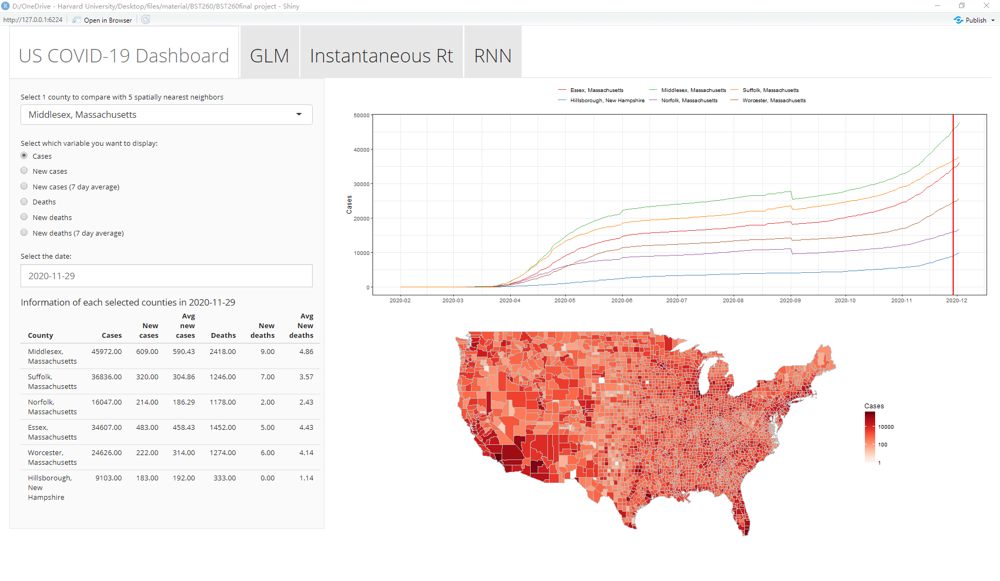
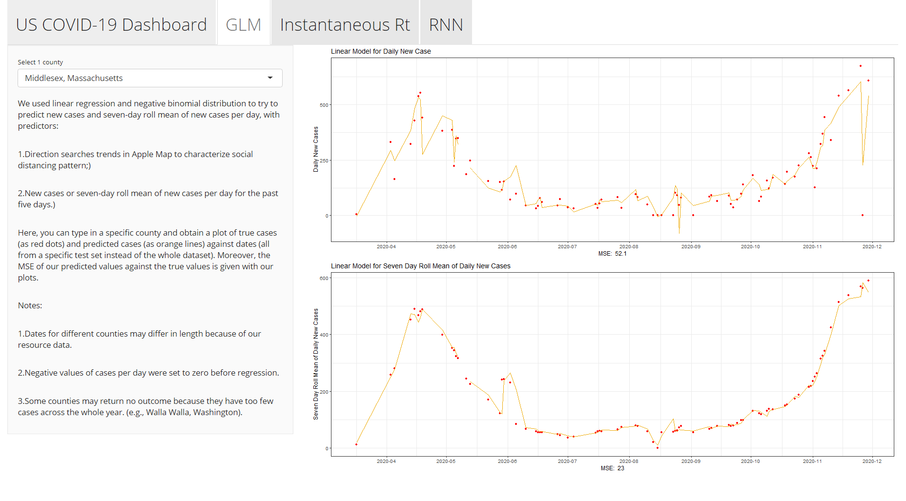
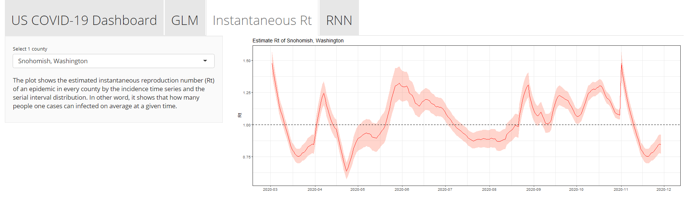
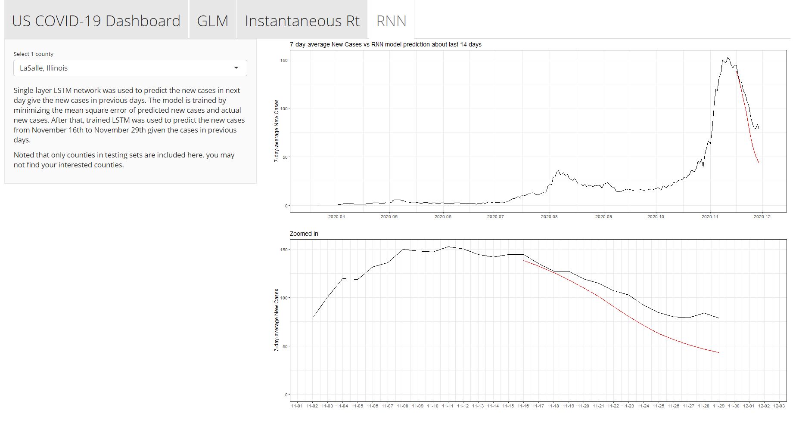

```{r setup, include=FALSE}
knitr::opts_chunk$set(echo = TRUE)
```

## Overview and Motivation
COVID-19 has been rapidly evolving in the world, causing huge economic loss and numerous death. The United States now has most of the cases and deaths in the world. According to world health orgranization (WHO), there are more than 16 million cases in the US and more than 0.3 million of people died due to COVID-19. 
\
It is important to analyze the underlying reason of fast spreading of covid-19 and predict the future trend of COVID-19 development. The predicted trends can help us identify regions that are most vulnerable to covid19 spread, which could be a guideline to set lockdown policy, distribute vaccine and PPE.  With accurately predicted trend, we could reduce the impact of pandemic on economic and public health even with limited resources.
\
In our project, we use four different methods, namely RNN, Instantaneous reproduction number (Rt), and GLM to predict daily new cases and deaths in each county of America, and a shiny app spatial data to detect potential hotspots of counties and aid finding the counties impacted heavily by COVID-19, and serveas an efficient  tool to visualize the data anaylsises. 

\

## Related Work

Our Shiny app is mainly inspried by the COVID-19 Dashborard by by the Center for Systems Science and Engineering (CSSE) at Johns Hopkins University (JHU) (https://coronavirus.jhu.edu/map.html). Therefore, we want to make an heatmap to show the general trend of COVID-19 in each county. We also incorprate the visualization of other three data analysis tools to visualize selected counties. 


## Initial Questions

In United States, county is an administrative subdivision of state. The average population of a county is around 100,000. It is the smallest units whose covid data is available across the United States. In some states, there are covid data in census tract level or in zip code region level. However, the same data is not available in all states. As a result, we choose to focus on  COVID-19 in county-level.
\
We aim to analyze the daily new cases and deaths among all counties in the US. Besides, we also plan to use the  available variables to predict the future trends of COVID-19 in US. We will use the data visualization skills to present our results clearly, aesthetically and interactively. 
\
We also want to assess whether COVID-19 daily new cases/deaths among all counties in the US is related to the geographic factors. From subject matter knowledge, we think there might be anassociation between the trend of COVID-19 in each county and its neighbor counties.


## Data Source
For all analysis, data of daily COVID-19 cases and deaths of each county was eleased by New York Times(https://github.com/nytimes/covid-19-data). we only include the data before December 2nd.
\
For GLM, the dataset we use comes from the link (https://github.com/Yu-Group/covid19-severity-prediction/tree/master/data). It is an abridged county-level dataset which combines data from several sources. It includes potential risk factors such as social distancing (with multiple indicators like mobility trends from Google and Apple and estimates of total vehicle miles travelled by residents of each county, each day), pre-exsited health conditions (cardiovascular diseases, diseases of respiratory system, etc), socioeconomic status, etc. Interestingly, the first one also includes presidential election result of each county in the Unites States between 2000 and 2016. 
\
For Shiny, the data to make the map for US counties is from “usmap” package. The geographic location (Latitude and Longitude) of each US county for computing and generating its spatially nearestneighbors was obtained from COVID-19 Data Repository by the Center for Systems Science and Engineering (CSSE) at Johns Hopkins University (https://github.com/CSSEGISandData/COVID-19). “sp”and “rgeos” package was used to calculate the package of spatial distances of each county.


## Exploratory Analysis
```{r message=FALSE, warning=FALSE}
library(tidyverse)
library(lubridate)

library(RColorBrewer)
library(maps)
library(usmap)
library(zoo) #rolling mean
library(sp)   #spatial nearest neighbour
library(rgeos)#spatial nearest neighbour

#GLM
library(caret)
library(MASS)


library(EpiDynamics)
library(EpiEstim) 
library(R0)
library(distcrete)
library(epitrix)
library(projections)
library(magrittr)
library(incidence)
library(splitstackshape)

###MASS and dplyr both have select
library(conflicted)
conflict_prefer("select", "dplyr")
conflict_prefer("filter", "dplyr")
conflict_prefer("lag", "dplyr")

```

### Instantaneous reproduction number (Rt)
\
Before we do the prediction of trend, we did the descriptive analysis of the trend of cases in different states to have an overview of the data.
\
```{r}
counties <- read.csv("us-counties.csv")
counties$date<-ymd(counties$date)
counties<-counties%>%
  mutate(key=paste(county,state))%>%
  mutate(date=ymd(counties$date))%>%
  group_by(key)%>%
  arrange(date)%>%
  mutate(new_case=cases-lag(cases,default = 0))%>%
  mutate(new_death=deaths-lag(deaths,default = 0))%>%
  mutate(average=rollmean(new_case, k = 7, fill = NA))
```

```{r,fig.width=4,fig.height=2}
counties%>%filter(state!="Northern Mariana Islands"&state!="Guam"&state!="Virgin Islands"&state!="Puerto Rico"&state!="Rhode Islands")%>%
  ggplot(aes(x=date,y=as.numeric(average)))+
  geom_line(col="coral1")+
  facet_wrap(~state)+
  theme(axis.line=element_blank(),axis.text.x=element_blank(),
          axis.text.y=element_blank(),axis.ticks=element_blank(),
          axis.title.x=element_blank(),
          axis.title.y=element_blank(),legend.position="none",
          panel.background=element_blank(),panel.border=element_blank(),panel.grid.major=element_blank(),
          panel.grid.minor=element_blank(),plot.background=element_blank())
  
```
\
Since we want to give people information about the trend of covid-19, we want to construct an SEIR model at the beginning. However, traditional SEIR model with fixed reproductive number does not fit well in this situation since it has been a long time since the outbreak of Covid-19 in United States and many different policy and event has happened during this period which would significantly change the reproductive number. Therefore, we choose to estimate the Instantaneous reproduction number (Rt) firstly and people can easily predict the trend of new cases in future days although it is very imprecise in long-term.
\
Therefore, I searched for relevant literature. In Anne Cori (2013) from Imperial College of London introduced a framework which could estimate the time varying estimate of reproductive number during epidemics. The detailed method is clearly explained in the paper.


### GLM
When considering regression methods, the fisrt method popping up is linear regression. Furthermore, since new daily cases of COVID-19 can be viewed as count data, Poisson regression may also fit our purposes. However, the mean = variance assumption is hardly ever satisfied, so we tried negative binomial regression, an extension to Poisson regression. The above-mentioned assumption is no longer needed. Since we are analyzing county-wise data and there are over 3000 counties in the United States, we will take Los Angeles County as an example and scale up using RShiny.

```{r}
#datasets used
apple <- read.csv("apple.csv")
infection <- read.csv("us-counties.csv")
```

```{r}
LAC_clean <- read.csv("LAC_clean.csv")
head(LAC_clean)
LAC_clean <- `colnames<-`(LAC_clean, c("Date", "Driving", "Transit", "Walking", "y", "one", "two", "three", "four", "five"))
LAC_clean$Date = as.Date(LAC_clean$Date)
train_index <- createDataPartition(LAC_clean$y, p = 0.7, list = F)
training <- LAC_clean[train_index,]
testing <- LAC_clean[-train_index,]

#No. of rows missing
sort(colSums(is.na(LAC_clean))[which(colSums(is.na(LAC_clean)) > 0)])
```

First, we load in a wrangled version of data where social distancing factors are characterized by "Directions" searches trends on Apple Map (for example, "9.10" means that on 2020-01-21, searches for driving directions on Apple Map increased by 9.1% than 2020-01-20). Moreover, new confirmed cases will be the outcome where new confirmed cases for the past five days will also be used as predictors, along with the social distancing factors. Because we have a lot of data , we will leave 30% of the data for testing.

#### Linear and Negative Binomial Models
##### Linear Model for Daily New Cases
```{r}
# linear model
model3 <- lm(y ~ Driving + Transit + Walking + one + two + 
         three + four + five, data = training)

summary(model3)


# testing set
plot(testing$Date, testing$y, type = "p")
predA <- predict(model3, testing)
lines(testing$Date, (predA), col=2)
sqrt(mean(((testing$y-(predA)))^2, na.rm = T))
```

Fitting our linear model, we noticed that new daily cases curves are not smooth. Calculating the MSE, we noticed that we obtain a somewhat satisfactory fit,considering the large amount of daily cases averagely. Next, we will look at the negative binomial regression.

#### Negative Binomial Model for Daily New Cases
```{r, message=FALSE, warning=FALSE}
# glm model
model3 <- glm.nb(y ~ Driving + Transit + Walking + one + two + 
                   three + four + five, data = training)
#summary(model3)

# testing set
plot(testing$Date, testing$y, type = "p")
predA <- predict(model3, testing)
lines(testing$Date, exp(predA), col=2)
sqrt(mean(((testing$y-exp(predA)))^2, na.rm = T))
```

Despite our previous assumption, the negative binomial distribution has worse predictablility on the data and generally tends to overestimate new cases compared to out linear model. We wonder if a smoother curve will lower the noise and provide us with a better model.

##### Linear Model for Seven-Day Roll Mean of Daily New Cases
```{r,message=FALSE, warning=FALSE}

plot(LAC_clean$Date[4:312], rollmean(LAC_clean$y, k = 7, fill = NA)[4:312], type = "l")

LAC_clean$sdm <- rollmean(LAC_clean$y, k = 7, fill = NA)
LAC_clean$sdm_1 <- rollmean(LAC_clean$one, k = 7, fill = NA)
LAC_clean$sdm_2 <- rollmean(LAC_clean$two, k = 7, fill = NA)
LAC_clean$sdm_3 <- rollmean(LAC_clean$three, k = 7, fill = NA)
LAC_clean$sdm_4 <- rollmean(LAC_clean$four, k = 7, fill = NA)
LAC_clean$sdm_5 <- rollmean(LAC_clean$five, k = 7, fill = NA)

training <- LAC_clean[train_index,]
testing <- LAC_clean[-train_index,]

# linear model
model3 <- lm(y ~ Driving + Transit + Walking + sdm_1 + sdm_2 + 
               sdm_3 + sdm_4 + sdm_5, data = training)

summary(model3)

# testing set
plot(testing$Date, testing$y, type = "p")
predA <- predict(model3, testing)
lines(testing$Date, (predA), col=2)
sqrt(mean(((testing$y-(predA)))^2, na.rm = T))
```

Inspired by the mid-term examination, we tried seven-day roll mean where local noises for a specific day will exert less influence. Although we cannot see a clear change in the smoothness of the curve, we do obtain a better fit, 311.5 with previous 461.4 MSE. Let's see if the negative binomial model also performs better.

##### Negative Binomial Model for Seven-Day Roll Mean of Daily New Cases
```{r,message=FALSE, warning=FALSE}
# glm model

model3 <- glm.nb(y ~ Driving + Transit + Walking + sdm_1 + sdm_2 + 
                   sdm_3 + sdm_4 + sdm_5, data = training)

#summary(model3)

# testing set
plot(testing$Date, testing$y, type = "p")
predA <- predict(model3, testing)
lines(testing$Date, exp(predA), col="blue")
sqrt(mean(((testing$y-exp(predA)))^2, na.rm = T))
```

MSE of 508.4 is a huge increase from 662.3. It confirms that our attempt at modeling seven-day roll mean of new daily cases is more successful, which may result from the fact that seven-day roll mean is more associated with cases from the past five days. However, it also confirms that our negative binomial models generally performs worse. This may result from choices of predictors.

Finally, we decide to present both new cases and seven-day roll mean of new cases, but we will leave negative binomial regression behind.


### RNN

### Shiny app
For the geographic factors, a shiny app with data exploration of an interactive line plot that allows you to explorethe time trend of daily new cases/deaths of each selected county and its 5 spatially nearest counties. An interactive heatmap showing daily new cases/deathsof all counties in each selected date was also made. 
\
In all our data analysis, Instantaneous Rt, GLM, and RNN were conducted in each county. However, it is impractical toassess over 3000 counties and fitting and visualizing the models without an interactivetool. So we used Shiny to allow readers to visualize our fitted model in eachselected counties. And we included the visualization in three separate tabs of "GLM", "Instantaneous Rt", and "RNN", in which you could select the county andthe visualization of the prediction will be shown.
\
Here I will show how I computed 5 spatial nearest neighbour. And here is an example code to show how I plot the trend of cumulative cases spatially neastest neighbours of Middlesex, Massachusettswith and heatmap of cumulative cases in US in 2020-11-01. Detailed code please see "app.r" file.

```{r echo = T, results = "hide",message=FALSE}


######################
# Covid-19-dashboard #
######################
us_counties <- read_csv("us-counties.csv")
us_counties[us_counties$fips=="35013",]$county=="dona ana" #Do??a Ana

allcounty <- map_data("county") %>%
    mutate(subregion=str_remove_all(subregion,pattern="\\s"))
allcounty[allcounty$region=="south dakota"&allcounty$subregion=="shannon",]$subregion<-"Oglala Lakota"


us_counties<-us_counties %>%
    mutate(region=tolower(state),
           subregion=tolower(county),
           subregion=str_remove_all(subregion,pattern="\\s"),# counties named "st. xxx"
           subregion=str_remove_all(subregion,pattern="\\.")) %>% # counties named "st. xxx"
    group_by(county,state) %>%
    arrange(date) %>%
    mutate(newcases=cases-lag(cases),
           newcases=ifelse(newcases<0,0,newcases),
           newcases7dayavg=rollmean(newcases, k = 7, fill = NA),
           newdeaths=deaths-lag(deaths),
           newdeaths=ifelse(newdeaths<0,0,newdeaths),
           newdeaths7dayavg=rollmean(newdeaths, k = 7, fill = NA)) %>%
    ungroup()

#######################################
#computing 6 spatial nearest neighbour#
#######################################
time_series_covid19_confirmed_US <- read_csv("time_series_covid19_confirmed_US.csv")
time_series_covid19_confirmed_US[which(time_series_covid19_confirmed_US$FIPS=="36061"),]$Admin2 <-"New York City"

spatialdata <- time_series_covid19_confirmed_US %>%
    mutate(region=tolower(Province_State),
           subregion=tolower(Admin2),
           subregion=str_remove_all(subregion,pattern="\\."),#remove . from place named "st. xxx"
           subregion=str_remove_all(subregion,pattern="\\s"),
           subregion=str_remove_all(subregion,pattern="\\'")) %>%
    select(region,subregion,Lat,Long_)
sp.spatialdata<-spatialdata
coordinates(sp.spatialdata) <- ~Long_+Lat
d <- gDistance(sp.spatialdata, byid=T)
#min0.d is 1st nearest county: itself
#minx.d is xth nearest county
min0.d <- apply(d, 1, function(x) order(x, decreasing=F)[1])
min1.d <- apply(d, 1, function(x) order(x, decreasing=F)[2])
min2.d <- apply(d, 1, function(x) order(x, decreasing=F)[3])
min3.d <- apply(d, 1, function(x) order(x, decreasing=F)[4])
min4.d <- apply(d, 1, function(x) order(x, decreasing=F)[5])
min5.d <- apply(d, 1, function(x) order(x, decreasing=F)[6])
min6.d <- apply(d, 1, function(x) order(x, decreasing=F)[7])

#
newdata <- cbind(spatialdata,
                 spatialdata[min0.d,c("region","subregion")],
                 spatialdata[min1.d,c("region","subregion")],
                 spatialdata[min2.d,c("region","subregion")],
                 spatialdata[min3.d,c("region","subregion")],
                 spatialdata[min4.d,c("region","subregion")],
                 spatialdata[min5.d,c("region","subregion")])
colnames(newdata) <- c(colnames(spatialdata),
                       "neighbor0nregion", "neighbor0nsubregion",
                       "neighbor1nregion", "neighbor1nsubregion",
                       "neighbor2nregion", "neighbor2nsubregion",
                       "neighbor3nregion", "neighbor3nsubregion",
                       "neighbor4nregion", "neighbor4nsubregion",
                       "neighbor5nregion", "neighbor5nsubregion")
# convering the data format from wide data to long data,
# then to wide data with "n","region","subregion"
spatialneighbordata<-newdata %>%
    gather(key, value,"neighbor0nregion":"neighbor5nsubregion") %>%
    tidyr::extract(key, c("n", "regionsubregion"), "(\\d)([a-z]+)")%>%
    spread("regionsubregion", value)

#joining captialized names of state and county into "spatialneighbordata"
spatialneighbordata<-us_counties %>%
    mutate(placeforselect=str_c(county,state,sep=", ")) %>%
    select(placeforselect,county,state,region,subregion) %>%
    distinct(placeforselect,county,state,region,subregion) %>%
    left_join(spatialneighbordata,by=c("region","subregion"))
```


```{r}
##example code from r shiny tab "Covid-19-dashboard"
spatialneighbordata %>%
            #filter the selected county
            filter(placeforselect=="Middlesex, Massachusetts") %>%
            #joining dataset to show 6 nearest counties of selected county
            left_join(us_counties,by=c("nregion"="region","nsubregion"="subregion")) %>%
            #delect useless column
            select(placeforselect, date:newdeaths7dayavg) %>%
            #mutating place: convert county name into "County, State" formate for different color
            mutate(place=str_c(county.y,state.y,sep=", "))  %>%
            ggplot(aes(x=date,y=cases,color=place))+
            geom_line(alpha=0.9,size=0.5)+
            scale_x_date(limits=c(),date_breaks = "1 month", labels = scales::date_format("%Y-%m"))+
            theme_bw()+
            theme(axis.text.x=element_text(angle=45, hjust=1))+
            theme(legend.position = "top")+
            scale_color_manual(name=NULL,values=c("#E41A1C","#377EB8","#4DAF4A","#984EA3","#FF7F00",
                                                  "#A65628","#000000"))+
            labs(x="",y="Cases",title="Example from Rshiny: Trend of Cumulative Cases Spatially Neastest Neighbours of Middlesex, Massachusetts")

us_counties %>%
            filter(date=="2020-11-01") %>%
            full_join(allcounty,by=c("region","subregion")) %>%
            ggplot(aes(x = long, y = lat, group = group))+
            geom_polygon(aes(fill=cases),color = "gray")+
            theme(panel.grid.major = element_blank(),
                  panel.background = element_blank(),
                  axis.text = element_blank(),
                  axis.ticks = element_blank())+
            coord_fixed(1.3)+
            scale_fill_gradientn(name="Cases",
                                     colors = brewer.pal(9,"Reds"),
                                     trans="log10",
                                     na.value="white")+
            labs(title="Example from Rshiny: Heatmap of Cumulative Cases in US in 2020-11-01")
    

```


 

## Final analysis

### Instantaneous reproduction number (Rt)

\
We estimate the instantaneous reproduction number (Rt) by using the serial interval distribution given by a study based on 86 Chinese cities. We used the gamma distribution to estimate the distribution of serial interval, where mu=5.24 and sd=2.36 given by this paper (Du, Z. et.al., 2020). 
\
```{r}
mu <- 5.49
sigma <- 2.54
cv <- sigma / mu
params <- gamma_mucv2shapescale(mu, cv)
si <- distcrete("gamma", shape = params$shape,
                scale = params$scale,
                interval = 1L, w = 0.5)
si<-c(0,si$d(1:20))
```
\
In the paper we mentioned above, the author indicate that the estimation is expected to be less variable as the window size increases, because 2 successive time windows will then have increasing overlap. Therefore, we specify the start time as 14 days-28 days, which considered as one to two max serial intervals where we believe the data is more convincing than what it was in the first few days. And the end time is 14 days before the last date to the last day.
\
```{r}
NYC<-counties%>%
  filter(county=="New York City")%>%
  drop_na(average)
Civ.R=EstimateR(NYC$average, T.Start=14:(nrow(NYC)-14), T.End=28:nrow(NYC), method="NonParametricSI",SI.Distr=si, plot=TRUE, leg.pos=xy.coords(1,3))
NYC_plot<-as.data.frame(cbind(NYC$date,Civ.R[["R"]][["Mean(R)"]],Civ.R[["R"]][["Quantile.0.975(R)"]],Civ.R[["R"]][["Quantile.0.025(R)"]]))
names(NYC_plot)=c("date","mean","high","low")
```
\
```{r}
NYC_plot$date<-as.Date(NYC_plot$date, origin = "1970-01-01")
ggplot(NYC_plot)+
  geom_line(aes(x=date,y=mean),col="red")+
  geom_ribbon(aes(x=date,ymin=low,ymax=high),alpha=0.3,fill="coral1")+
  scale_x_date(date_breaks = "2 month")+
  labs(y="Rt",x="Date",title = "Estimated Rt of New York City")+
  geom_hline(yintercept = 1,col="black", linetype="dashed")+
  theme_minimal()
```
\
Now we have a plot of Rt. The concept of Rt is different from R0. R0 refers to expected number of cases directly generated by one case in a population where all individuals are susceptible to infection. While Rt refers to number of people one cases can infect on average at a given time in current state of population. 
\
Therefore, when the when Rt>1, it means the Covid-19 will infect more people and daily. For example, in New York City, we can find that the Rt is very high in march and in early November and the trend is slowly increasing between late April and November. It may reflect lockdown, four-phase reopening plan start in April, and the presidential election.
\
```{r}
NYC_pred<-NYC%>%
  filter(NYC$new_case!=0)%>%
  expandRows("new_case")

i=incidence(NYC_pred$date)

pred_1 <- project(i[1:(nrow(NYC)-14-7)],R=list(NYC_plot$mean[(nrow(NYC)-14-7):(nrow(NYC)-14)],NYC_plot$mean[(nrow(NYC)-7):nrow(NYC)]), si = si, n_days = 30, n_sim = 50,time_change = 21)

```

```{r}
plot(i[(nrow(NYC)-22):(nrow(NYC)-1)], alpha = 0.5) %>%
  add_projections(pred_1, boxplots = FALSE, quantiles = c(0.025, 0.5)) +
  theme_bw()+
  labs(title="Predicted Daily incidence versus real data")
```
\
In this plot, we estimate the daily incidence for 21 days from Nov.10. In this plot, the new cases fits well with the observed data and daily new cases in predicted to be dropped after Dec.04.

### GLM: Generalizability - Other Counties
```{r, echo=FALSE, warning=FALSE, message = FALSE}

#data wrangling after a county is chosen
county_code_choose <- unique(apple$countyFIPS[which(apple$Region == "adams county" & apple$State.Province == "Ohio")])
infection_choose <- infection %>% filter(fips == county_code_choose) %>% dplyr::select(-deaths) %>% mutate(date = as.Date(date))
apple_choose <- apple %>% filter(countyFIPS == county_code_choose) %>% dplyr::select(-c(X,State.Province,Region,countyFIPS)) %>% spread(Sector,Percent.Change) %>% mutate(Date = as.Date(Date))
dat <- right_join(apple_choose,infection_choose,by = c("Date" = "date")) %>% mutate(new_cases = cases-lag(cases))
dat$new_cases = ifelse(dat$new_cases<0,0,dat$new_cases)
dat <- dat %>% mutate(one = lag(new_cases,1), two = lag(new_cases,2), three = lag(new_cases,3), four = lag(new_cases,4), five = lag(new_cases,5))
dat$sdm <- rollmean(dat$new_cases, k = 7, fill = NA)
dat$sdm_1 <- rollmean(dat$one, k = 7, fill = NA)
dat$sdm_2 <- rollmean(dat$two, k = 7, fill = NA)
dat$sdm_3 <- rollmean(dat$three, k = 7, fill = NA)
dat$sdm_4 <- rollmean(dat$four, k = 7, fill = NA)
dat$sdm_5 <- rollmean(dat$five, k = 7, fill = NA)
dat$Date <- as.Date(dat$Date)
dat <- dat%>% filter(is.na(dat$new_cases)==F)
dat$new_cases <- ifelse(dat$new_cases<0,0,dat$new_cases)
#divide training and testing data
set.seed(520)
train_index <- createDataPartition(dat$new_cases, p = 0.7, list = F)
training <- dat[train_index,]
testing <- dat[-train_index,]

#linear model for new cases
plain_lm <- lm(new_cases ~ driving + sdm_1 + sdm_2 + sdm_3 + sdm_4 + sdm_5, data = training)
#linear model for seven-day roll mean of new cases
mean_lm <- lm(sdm~ driving + sdm_1 + sdm_2 + sdm_3 + sdm_4 + sdm_5, data = training)
#predictions using the two models
pred_plain <- predict(plain_lm, testing)
pred_mean <- predict(mean_lm, testing)
#plots
ggplot(testing)+geom_point(aes(x=Date,y=new_cases),color = "red")+
  scale_x_date(date_breaks = "1 month")+
  theme(axis.text.x = element_text(angle = 40, hjust = 1))+
  geom_line(aes(x=Date, y=pred_plain),color="darkorange3", size = 2, alpha = 0.4)+
  ylab("Daily New Cases")

ggplot(testing)+geom_point(aes(x=Date,y=sdm),color = "red")+
  scale_x_date(date_breaks = "1 month")+
  theme(axis.text.x = element_text(angle = 40, hjust = 1))+
  geom_line(aes(x=Date, y=pred_mean),color="darkorange3", size = 2, alpha = 0.4)+
  ylab("Seven Day Roll Mean of Daily New Cases")
```

```{r}
#MSE of the daily cases model
sqrt(mean(((testing$new_cases-(pred_plain)))^2, na.rm = T))
#MSE of the seven-day roll mean model
sqrt(mean(((testing$sdm-(pred_mean)))^2, na.rm = T))
```


Here, to test for generalizaility, we choose Adams County from Ohio becase it has considerably less daily cases. We can see that modeling seven-day roll mean better predict sharp increases like in the case of Adams, Ohio in November. Seven-day roll mean also generate considerably smaller MSE.

```{r, echo=FALSE, warning=FALSE, message = FALSE}

#data wrangling after a county is chosen
county_code_choose <- unique(apple$countyFIPS[which(apple$Region == "suffolk county" & apple$State.Province == "Massachusetts")])
infection_choose <- infection %>% filter(fips == county_code_choose) %>% dplyr::select(-deaths) %>% mutate(date = as.Date(date))
apple_choose <- apple %>% filter(countyFIPS == county_code_choose) %>% dplyr::select(-c(X,State.Province,Region,countyFIPS)) %>% spread(Sector,Percent.Change) %>% mutate(Date = as.Date(Date))
dat <- right_join(apple_choose,infection_choose,by = c("Date" = "date")) %>% mutate(new_cases = cases-lag(cases))
dat$new_cases = ifelse(dat$new_cases<0,0,dat$new_cases)
dat <- dat %>% mutate(one = lag(new_cases,1), two = lag(new_cases,2), three = lag(new_cases,3), four = lag(new_cases,4), five = lag(new_cases,5))
dat$sdm <- rollmean(dat$new_cases, k = 7, fill = NA)
dat$sdm_1 <- rollmean(dat$one, k = 7, fill = NA)
dat$sdm_2 <- rollmean(dat$two, k = 7, fill = NA)
dat$sdm_3 <- rollmean(dat$three, k = 7, fill = NA)
dat$sdm_4 <- rollmean(dat$four, k = 7, fill = NA)
dat$sdm_5 <- rollmean(dat$five, k = 7, fill = NA)
dat$Date <- as.Date(dat$Date)
dat <- dat%>% filter(is.na(dat$new_cases)==F)
#divide training and testing data
set.seed(520)
train_index <- createDataPartition(dat$new_cases, p = 0.7, list = F)
training <- dat[train_index,]
testing <- dat[-train_index,]

#linear model for new cases
plain_lm <- lm(new_cases ~ driving + sdm_1 + sdm_2 + sdm_3 + sdm_4 + sdm_5, data = training)
#linear model for seven-day roll mean of new cases
mean_lm <- lm(sdm~ driving + sdm_1 + sdm_2 + sdm_3 + sdm_4 + sdm_5, data = training)
#predictions using the two models
pred_plain <- predict(plain_lm, testing)
pred_mean <- predict(mean_lm, testing)
#plots
ggplot(testing)+geom_point(aes(x=Date,y=new_cases),color = "red")+
  scale_x_date(date_breaks = "1 month")+
  theme(axis.text.x = element_text(angle = 40, hjust = 1))+
  geom_line(aes(x=Date, y=pred_plain),color="darkolivegreen3", size = 2, alpha = 0.4)+
  ylab("Daily New Cases")

ggplot(testing)+geom_point(aes(x=Date,y=sdm),color = "red")+
  scale_x_date(date_breaks = "1 month")+
  theme(axis.text.x = element_text(angle = 40, hjust = 1))+
  geom_line(aes(x=Date, y=pred_mean),color="darkolivegreen3", size = 2, alpha = 0.4)+
  ylab("Seven Day Roll Mean of Daily New Cases")

#MSE of the daily cases model
sqrt(mean(((testing$new_cases-(pred_plain)))^2, na.rm = T))
#MSE of the seven-day roll mean model
sqrt(mean(((testing$sdm-(pred_mean)))^2, na.rm = T))
```

```{r}
#data wrangling after a county is chosen
dat <- LAC_clean
#divide training and testing data
set.seed(520)
train_index <- createDataPartition(dat$y, p = 0.7, list = F)
training <- dat[train_index,]
testing <- dat[-train_index,]

#linear model for new cases
plain_lm <- lm(y ~ Driving + sdm_1 + sdm_2 + sdm_3 + sdm_4 + sdm_5, data = training)
#linear model for seven-day roll mean of new cases
mean_lm <- lm(sdm~ Driving + sdm_1 + sdm_2 + sdm_3 + sdm_4 + sdm_5, data = training)
#predictions using the two models
pred_plain <- predict(plain_lm, testing)
pred_mean <- predict(mean_lm, testing)
#plots
ggplot(testing)+geom_point(aes(x=Date,y=y),color = "red")+
  scale_x_date(date_breaks = "1 month")+
  theme(axis.text.x = element_text(angle = 40, hjust = 1))+
  geom_line(aes(x=Date, y=pred_plain),color="darkorchid3", size = 2, alpha = 0.4)+
  ylab("Daily New Cases")

ggplot(testing)+geom_point(aes(x=Date,y=sdm),color = "red")+
  scale_x_date(date_breaks = "1 month")+
  theme(axis.text.x = element_text(angle = 40, hjust = 1))+
  geom_line(aes(x=Date, y=pred_mean),color="darkorchid3", size = 2, alpha = 0.4)+
  ylab("Seven Day Roll Mean of Daily New Cases")

#MSE of the daily cases model
sqrt(mean(((testing$y-(pred_plain)))^2, na.rm = T))
#MSE of the seven-day roll mean model
sqrt(mean(((testing$sdm-(pred_mean)))^2, na.rm = T))
```


### RNN

### Shiny app
Code of our shiny app is included in "app.r" file. Our shiny app included four sections, "US COVID-19 Dashboard", "GLM", "Instantaneous Rt", and "RNN", as shown in following figure. "GLM", "Instantaneous Rt", and "RNN", visualize the three other kinds of our analysis, respectively.
\



\
"US COVID-19 Dashboard" section focused on using spatial data to detect potential hot spots of counties and aid find the counties impacted heavily by COVID-19. In the "US COVID-19 Dashboard" section, take Middlesex, Massachusetts as an example, you can see the line plot will automatically generate a line plot to show the time trend of cases (or new cases, new cases (7 day average), deaths, new deaths, or new deaths 7day average. Then data of the 5 counites spatially nearest to Middlesex, Massachusetts will be plotted. As shown, those 6 counties have a very similar cases trend of time. And shiny allows us to select the counties of our interest to compare this trend. The heatmap is another powerful tool to identify vulnerable counties or show potential risk. 
\
Three separate tabs of "GLM", "Instantaneous Rt", and "RNN" is the visualization of three analysis, Shiny will allow us to visualize our fitted model in each selected county. In all our data analysis, Instantaneous Rt, GLM, and RNN were conducted in each county. However, it is impractical to assess over 3000 counties and fitting and visualizing the models without an interactive tool. You could select the county and the visualization of the prediction will be shown.
\
In our analysis, Shiny can not only serve as an efficient tool to visualize and spot some potential ill-performance in some of the counties of the trained models. It will also benefit finding vulnerable counties and show potential risk. At this point of pandemic, identifying areas where have a higher burden of COVID-19 and identifying the counties that needed help most is one of the goals of our project.
\








##  Reference
Anne, C. , Ferguson, N. M. , Christophe, F. , & Simon, C. . (0). A new framework and software to estimate time-varying reproduction numbers during epidemics. American Journal of Epidemiology(9), 1505-1512.

Du, Z., Xu, X., Wu, Y., Wang, L., Cowling, B. J., & Meyers, L. A. (2020). COVID-19 serial interval estimates based on confirmed cases in public reports from 86 Chinese cities. medRxiv : the preprint server for health sciences, 2020.04.23.20075796.
